# Docker Monitoring Lab

A containerized monitoring environment built with Docker, Prometheus, Node Exporter, and Grafana, managed locally through Docker Desktop and Docker Compose.

The project demonstrates container monitoring, Prometheus metric collection, Grafana dashboarding, failure testing, persistent storage, troubleshooting, and Compose-based stack management.

## Project Overview

This project implements a local monitoring stack for two logical application nodes.

Each node contains:
- Nginx as the monitored service
- Node Exporter as the metrics exporter

Prometheus collects metrics from both Node Exporter containers, while Grafana visualizes the collected data through a monitoring dashboard.

The final implementation includes:
- 2 Nginx containers
- 2 Node Exporter containers
- Prometheus
- Grafana
- Custom Docker network
- Persistent Prometheus and Grafana volumes
- Grafana monitoring dashboard
- Failure and recovery testing
- Docker Compose orchestration

## Project Goals

The project was designed to build a practical containerized monitoring environment while demonstrating metrics collection, visualization, failure detection, persistent storage, and infrastructure management with Docker Compose.

## Architecture Diagram

The architecture diagram represents the verified project structure:

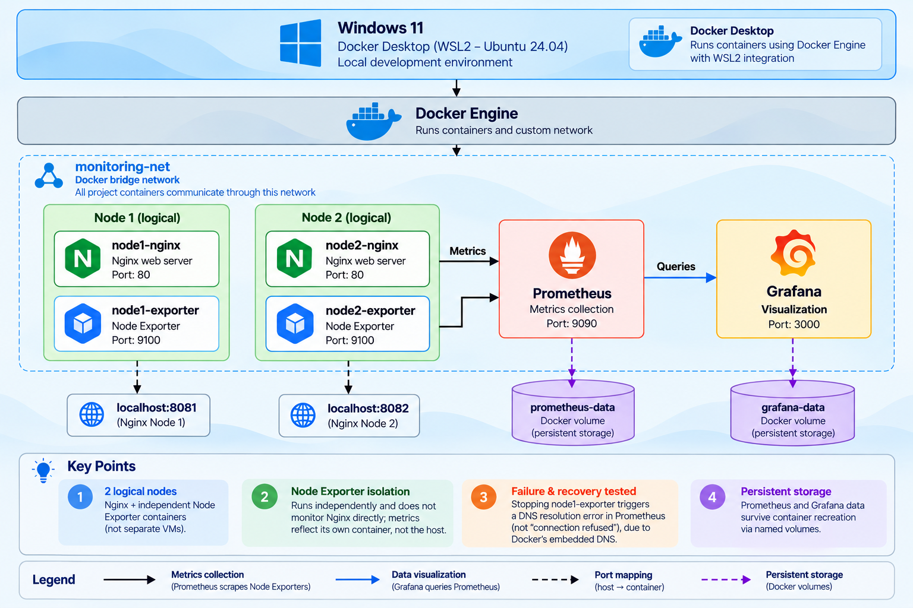

The two logical nodes are represented by Nginx and their independent Node Exporter containers. Prometheus scrapes both exporters, while Grafana queries Prometheus for visualization. Node1 and node2 are logical Docker services rather than separate VMs, and each Node Exporter runs in isolation — it does not monitor Nginx directly, and its metrics reflect its own container rather than the host. See the diagram's Key Points for the full list of design decisions, including failure/recovery behavior and persistent storage.

## Project Summary

| Technology | Purpose |
|---|---|
| Docker | Containerization and runtime |
| Docker Desktop | Local Docker environment |
| Docker Compose | Declarative management of the monitoring stack |
| Nginx | Monitored application service |
| Node Exporter | Prometheus metrics exporter |
| Prometheus | Metrics collection and storage |
| Grafana | Monitoring visualization and dashboarding |
| Docker Volumes | Persistent Prometheus and Grafana data |
| WSL2 | Linux environment integrated with Docker Desktop |

## Project Evolution

The project was built incrementally:

```text
Docker Setup
    ↓
Nginx Nodes
    ↓
Node Exporter
    ↓
Prometheus
    ↓
Grafana
    ↓
Dashboard
    ↓
Testing
    ↓
Persistence
    ↓
Persistence Troubleshooting
    ↓
Docker Compose
    ↓
Documentation
```

Each stage added a specific monitoring or operational capability without introducing unnecessary infrastructure.

## Docker Setup

Docker Desktop provides the local Docker environment on Windows, with Ubuntu 24.04 integrated through WSL2.

The monitoring stack uses a dedicated Docker bridge network:

```text
monitoring-net
```

All six project containers communicate through this network.

The final container layout is:

```text
Docker Engine
│
├── node1-nginx
├── node1-exporter
├── node2-nginx
├── node2-exporter
├── prometheus
└── grafana
```

## Monitoring Stack

### Nginx

Two Nginx containers represent the two logical monitoring nodes:

```text
node1-nginx
node2-nginx
```

They expose HTTP on different host ports:

```text
localhost:8081 → node1-nginx:80
localhost:8082 → node2-nginx:80
```

The Nginx containers provide a real service to monitor rather than using empty containers.

### Node Exporter

Each logical node has an independent Node Exporter container:

```text
node1-exporter:9100
node2-exporter:9100
```

Node Exporter exposes Prometheus-compatible metrics on port `9100`.

The exporters in this project run as independent containers without host `/proc` or `/sys` access and without sharing the Nginx containers' network namespaces.

Therefore, the collected system metrics represent the exporter containers' own environment rather than the Windows host or the underlying Docker Desktop host.

### Prometheus

Prometheus collects metrics from both Node Exporter containers.

The Prometheus configuration is stored in:

```text
prometheus/prometheus.yml
```

The configuration defines a 15-second scrape interval:

```yaml
global:
  scrape_interval: 15s
```

The `node-exporters` job contains:

```yaml
targets:
  - "node1-exporter:9100"
  - "node2-exporter:9100"
```

Prometheus target status was verified through:

```text
http://localhost:9090/targets
```

Both targets reported `UP` during normal operation.

### Grafana

Grafana provides the visualization layer for the Prometheus metrics.

Grafana connects to Prometheus using:

```text
http://prometheus:9090
```

The connection was verified through Grafana's Prometheus data source test and PromQL queries in Explore.

## Grafana Dashboard

The project includes a dashboard named:

```text
Docker Monitoring Dashboard
```

The dashboard is organized into three sections.

### Core Resources
- Memory Usage
- CPU Usage
- System Load

### Network
- Network Traffic
- Network Packets Received
- Network Errors Received
- Network Errors Transmitted

### System
- Uptime
- Running Processes

The dashboard compares Node 1 and Node 2 using Prometheus metrics.

The dashboard is displayed over a rolling recent time window, with the current view using the last 30 minutes. This is appropriate for a real-time infrastructure monitoring dashboard, where recent metric behavior is more relevant than long-term historical data for this lab.

Examples of the PromQL queries used include:

```promql
100 * (1 - (node_memory_MemAvailable_bytes / node_memory_MemTotal_bytes))
```

```promql
100 * (1 - avg by (instance) (rate(node_cpu_seconds_total{mode="idle"}[5m])))
```

CPU Usage note: The initial CPU spike visible at the beginning of the graph can occur during startup, when Prometheus has limited historical samples for the rate() calculation and the monitored containers are initializing. It should not be interpreted as sustained CPU usage.

```promql
node_load1
```

```promql
sum by (instance) (
  rate(node_network_receive_bytes_total{device!="lo"}[5m])
)
```

```promql
sum by (instance) (
  rate(node_network_transmit_bytes_total{device!="lo"}[5m])
)
```

Disk Usage was not added because the isolated Node Exporter containers do not expose the host filesystem metrics required for that visualization.

## Testing

The monitoring stack was tested by simulating a Node Exporter failure.

### Node Exporter Failure

The Node 1 exporter was stopped:

```bash
docker stop node1-exporter
```

Prometheus then reported:

```text
node1-exporter:9100 → DOWN
node2-exporter:9100 → UP
```

When the exporter container was stopped, Docker's embedded DNS resolver (`127.0.0.11`) no longer returned an address for `node1-exporter`, so Prometheus reported a DNS resolution error (`no such host`) rather than a connection-refused error.

The query:

```promql
up{job="node-exporters"}
```

returned:

```text
node1 → 0
node2 → 1
```

This verified that Prometheus detected the exporter failure while continuing to scrape Node 2.

### Recovery

Node 1's exporter was started again:

```bash
docker start node1-exporter
```

Prometheus returned to:

```text
node1-exporter:9100 → UP
node2-exporter:9100 → UP
```

The same `up` query returned:

```text
node1 → 1
node2 → 1
```

The recovery was also visible in Grafana.

## Persistence

Persistence was added after the monitoring and testing stages.

The goal was to ensure that Prometheus and Grafana data would survive container recreation.

### Prometheus Persistence

The original Prometheus container used an anonymous Docker volume for:

```text
/prometheus
```

The anonymous volume was identified through:

```bash
docker inspect prometheus --format '{{json .Mounts}}'
```

A named volume was then created:

```text
prometheus-data
```

The existing Prometheus data was copied into the named volume.

The Prometheus container was recreated using:

```text
prometheus-data → /prometheus
```

The Prometheus configuration remained a read-only bind mount:

```text
./prometheus/prometheus.yml
        ↓
/etc/prometheus/prometheus.yml
```

After recreation, Prometheus was verified and both exporters remained `UP`.

### Grafana Persistence

Grafana initially had no persistent volume.

A named volume was created:

```text
grafana-data
```

The existing Grafana data was copied from the container into the persistent volume.

The Grafana container was recreated using:

```text
grafana-data → /var/lib/grafana
```

The existing dashboard remained available after recreation, confirming that Grafana data had been persisted.

### Persistence Troubleshooting

The initial Grafana copy attempt using `--volumes-from` failed because `/var/lib/grafana` was not exposed through a volume in the original container.

The actual Grafana data directory was inspected directly:

```bash
docker exec grafana sh -c "ls -la /var/lib/grafana"
```

The data was then copied from the container using:

```bash
docker cp grafana:/var/lib/grafana/. /tmp/grafana-data/
```

and transferred into the named volume.

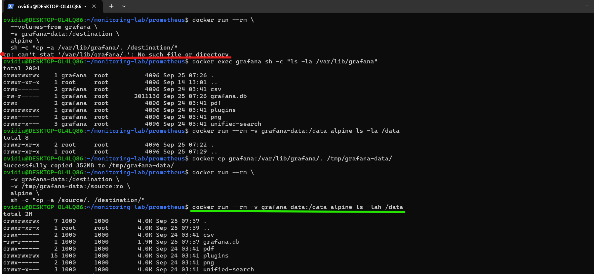

### Grafana Database Error

After recreating Grafana with the new persistent volume, Grafana initially failed to start with:

```text
Error: ✗ failed to check table existence:
unable to open database file (14)
```

The problem was investigated before changing the configuration.

The following checks were performed:
- The volume contained `grafana.db`.
- The SQLite database passed an integrity check.
- Read/write access was tested.
- The Grafana container runtime user was checked.
- The Grafana image reported:

```text
uid=472(grafana) gid=0(root)
```

The volume data had initially been owned by a different UID.

Ownership was corrected with:

```bash
docker run --rm   -v grafana-data:/var/lib/grafana   alpine   chown -R 472:0 /var/lib/grafana
```

The database ownership was verified as:

```text
472:0
```

Grafana was started again:

```bash
docker start grafana
```

The container returned to the `Up` state and the Grafana process was verified as running.

The dashboard was then opened successfully and the existing monitoring panels and data remained available.

This demonstrated a practical Docker persistence troubleshooting scenario involving container runtime identity and volume ownership.

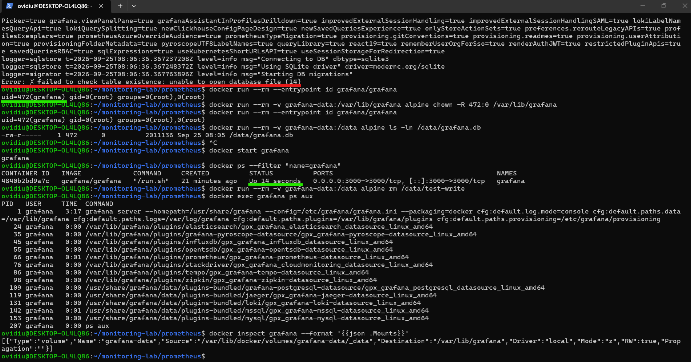

## Docker Compose

After the manual Docker implementation and persistence stages were completed, the complete monitoring stack was migrated to Docker Compose.

The Compose configuration is stored in:

```text
docker-compose.yml
```

It defines all six project services:

```text
node1-nginx
node1-exporter
node2-nginx
node2-exporter
prometheus
grafana
```

The project reuses the existing Docker network:

```yaml
networks:
  monitoring-net:
    external: true
    name: monitoring-net
```

The existing persistent volumes are also reused:

```yaml
volumes:
  prometheus-data:
    external: true
  grafana-data:
    external: true
```

Prometheus uses both its configuration bind mount and persistent volume:

```yaml
volumes:
  - ./prometheus/prometheus.yml:/etc/prometheus/prometheus.yml:ro
  - prometheus-data:/prometheus
```

Grafana uses:

```yaml
volumes:
  - grafana-data:/var/lib/grafana
```

The Compose configuration was validated with:

```bash
docker compose config
```

The existing manually created containers were stopped and removed without removing the persistent volumes.

The complete stack was started with:

```bash
docker compose up -d
```

All six project containers reported `Up`.

### Compose Verification

Prometheus readiness was verified with:

```bash
curl http://localhost:9090/-/ready
```

Prometheus API data was also checked with:

```bash
curl -s http://localhost:9090/api/v1/query?query=up
```

Both Node Exporter targets returned an `up` value of `1`.

Grafana health was verified with:

```bash
curl -s http://localhost:3000/api/health
```

The Grafana dashboard was opened again and all monitoring panels displayed current data.

This confirmed that the monitoring environment could be recreated from the Compose definition while reusing persistent data.

## Screenshots

The screenshots document the project chronologically, from Prometheus target verification and dashboard creation through testing and persistence troubleshooting.

### Prometheus Targets

This screenshot shows both Node Exporter targets reported as `UP` in Prometheus, confirming that Prometheus was successfully scraping metrics from Node 1 and Node 2.

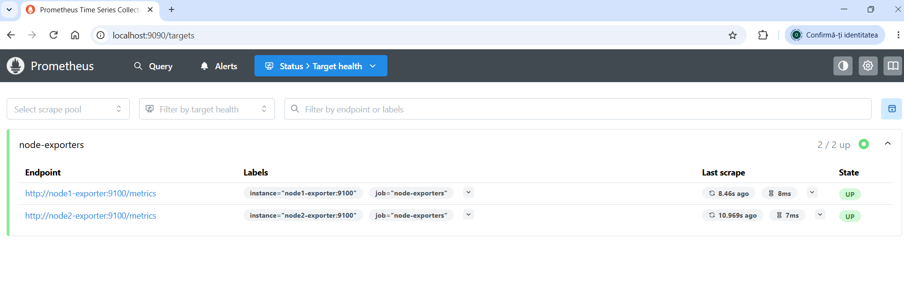

### Grafana Dashboard Overview

This screenshot shows the complete Grafana monitoring dashboard, providing an overview of the collected metrics for Node 1 and Node 2.

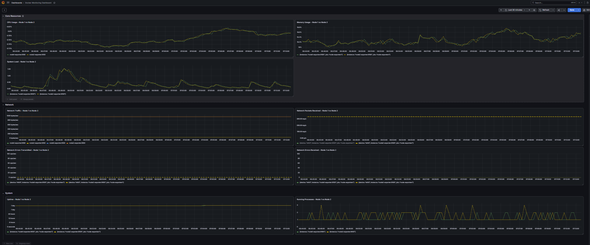

### Core Resources

This screenshot shows the Core Resources section of the dashboard, covering memory usage, CPU usage, and system load for both logical nodes.

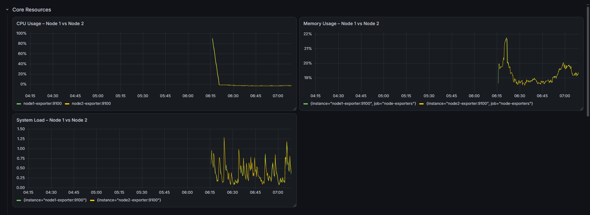

### Network

This screenshot shows the network monitoring section, including traffic, received packets, and network errors for Node 1 and Node 2.

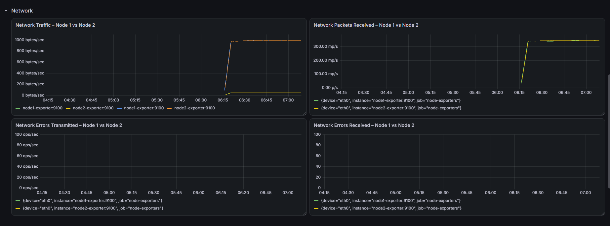

### System

This screenshot shows the System section, including exporter uptime and the number of currently running processes for both nodes.

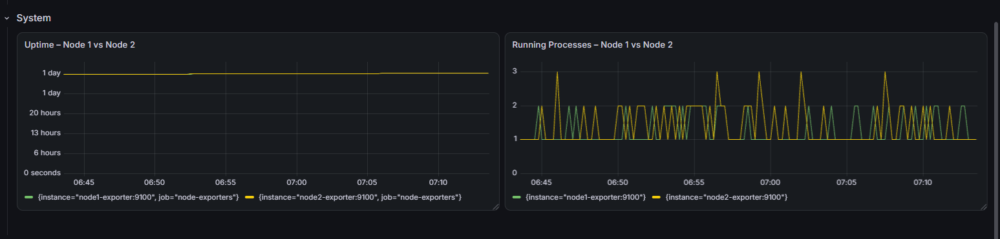

### Node 1 Down

This screenshot captures the failure test with the Node 1 exporter stopped. Prometheus reports Node 1 as `DOWN` while Node 2 remains `UP`, and the Grafana `up` metric reflects the same state.

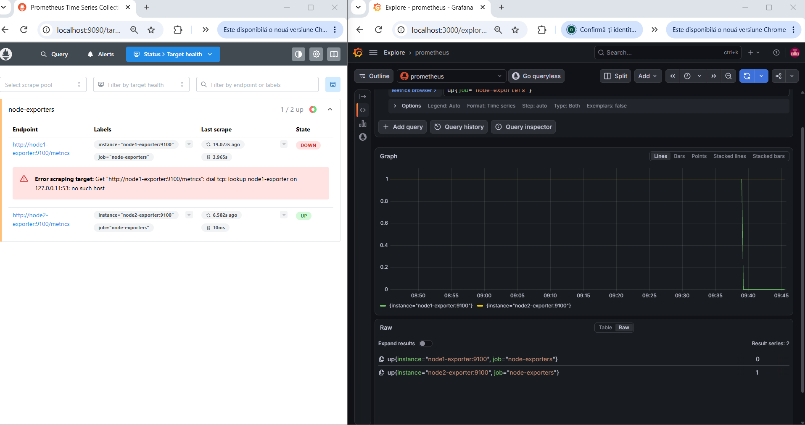

### Node 1 Recovered

This screenshot shows the recovery after restarting the Node 1 exporter. Both Prometheus targets are `UP` again, and the Grafana `up` metric confirms that both nodes are being scraped successfully.

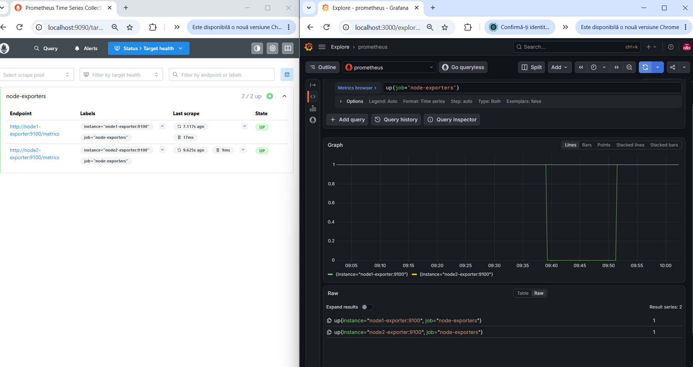

### Docker Compose

This screenshot shows the monitoring stack being started with Docker Compose, followed by verification that all six project containers are running. Prometheus and Grafana health checks also confirm that the services are operational.

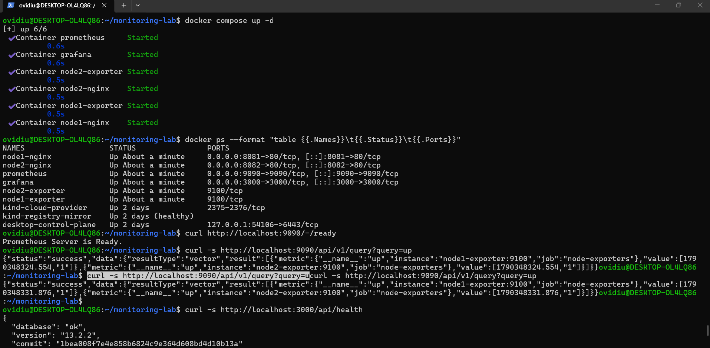

## Cleanup

The monitoring stack can be stopped and removed through Docker Compose:

```bash
docker compose down
```

This removes the Compose-managed containers while preserving the external persistent volumes:

```text
prometheus-data
grafana-data
```

The persistent volumes can be removed separately if the project data is no longer required.

## Future Improvements

Possible future extensions include:
- Additional Prometheus alerting rules
- Alertmanager integration
- Additional Grafana dashboards
- More detailed application-level metrics
- Host-level monitoring using a host-aware Node Exporter configuration
- Disk monitoring with appropriate host filesystem access
- More advanced Docker Compose configuration

These features are **not part of the current implementation**.

## Contact

GitHub: [OvidiuN19](https://github.com/OvidiuN19)
LinkedIn: [OvidiuNeagu](https://www.linkedin.com/in/ovidiu-dumitru-neagu-4680a8194/)
